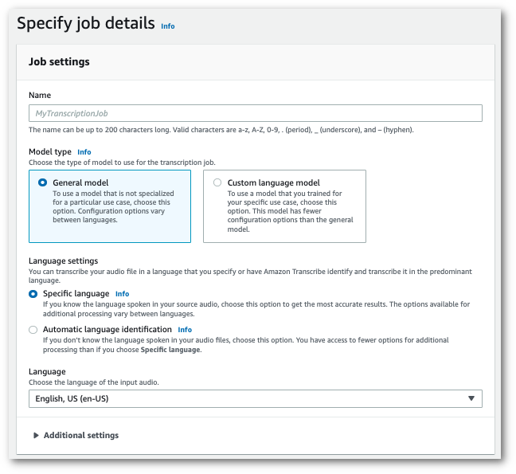
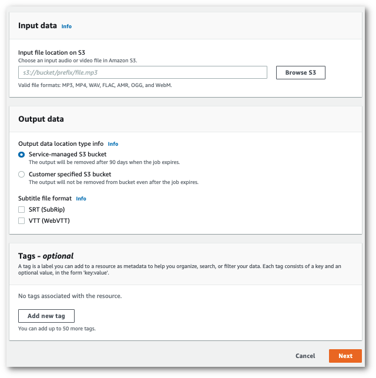
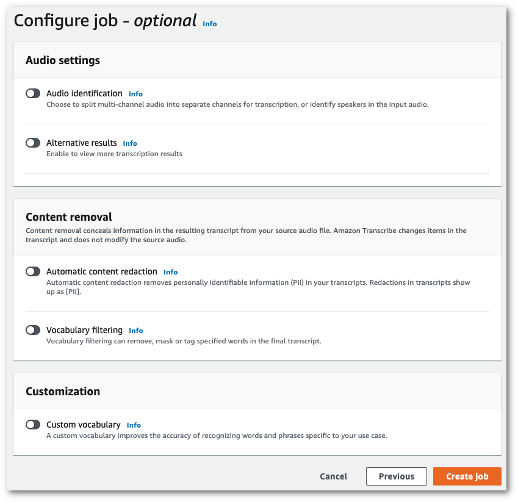
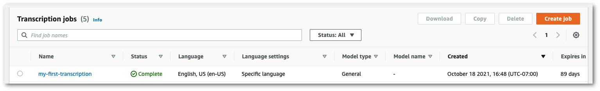
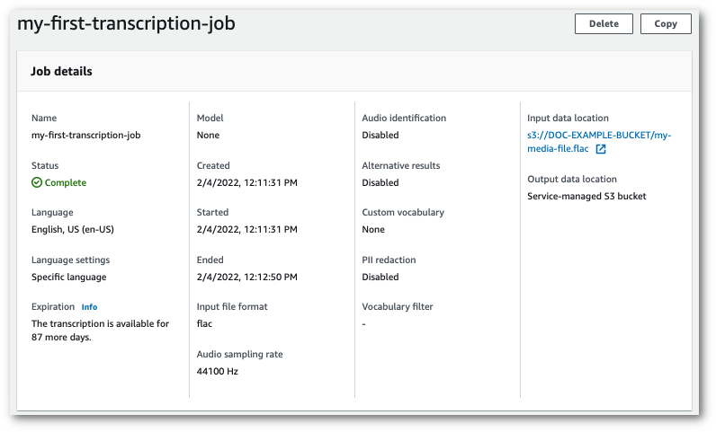
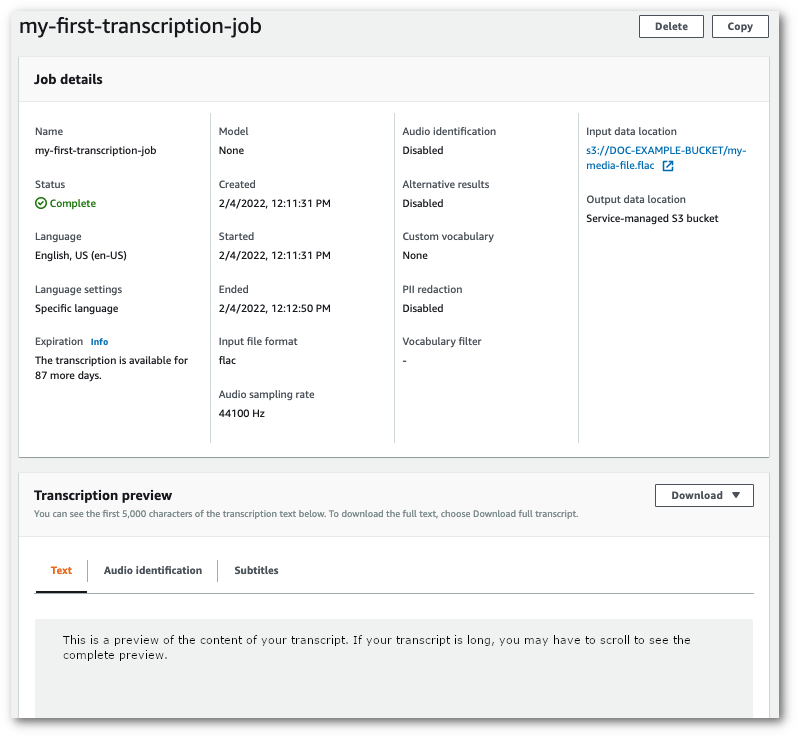
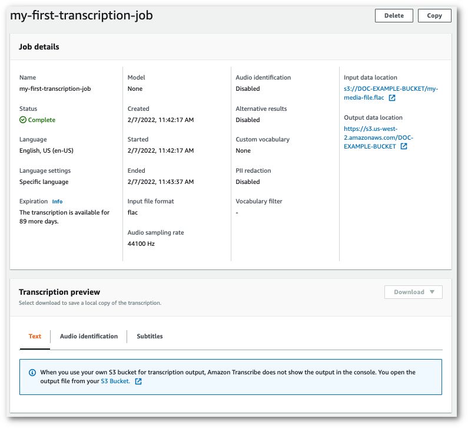
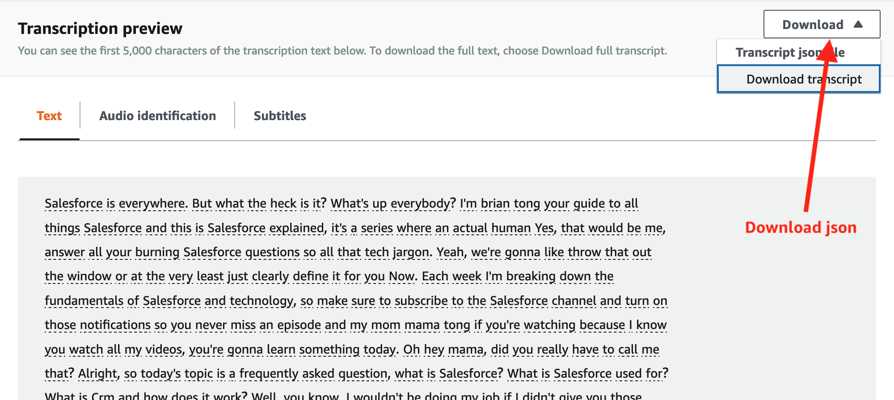

# Lab 1 - Batch processing

Prior to starting a batch transcription, you must first upload your media file to an Amazon S3 bucket. If you're unsure how to do this, refer to the Amazon S3 User Guide: [Upload an object to your bucket](https://docs.aws.amazon.com/AmazonS3/latest/userguide/uploading-an-object-bucket.html)

**If you don't have an audio file to test, you can download [sample audio](../static/audio/demo-call.mp3).**

1.  From the [AWS Management Console](https://console.aws.amazon.com/transcribe), select **Transcription jobs** in the left navigation pane. This takes you to a list of your transcription jobs.
    
    
    
    Select **Create job**.
    
2.  Complete the fields on the **Specify job details** page.
    
    
    
    The input location _must_ be an object within an Amazon S3 bucket. For output location, you can choose a secure Amazon S3 service-managed bucket or you can specify your own Amazon S3 bucket.
    
    If you choose a service-managed bucket, you can view a transcript preview in the AWS Management Console and you can download your transcript from the job details page (see below).
    
    If you choose your own Amazon S3 bucket, you cannot see a preview in the AWS Management Console and must go to the Amazon S3 bucket to download your transcript.
    
    
    
    Select **Next**.
    
3.  Choose default settings in the **Configure job** page. If you want to learn more about [Custom vocabularies](https://docs.aws.amazon.com/transcribe/latest/dg/custom-vocabulary.html) or [Custom language models](https://docs.aws.amazon.com/transcribe/latest/dg/custom-language-models.html), you can try them out in lab 3 and lab 4.
    
    
    
    Select **Create job**.
    
4.  You're now on the **Transcription jobs** page. Here you can see the status of the transcription job. Once complete, click on the name of your transcription.
    
    
    
5.  You're now viewing the **Job details** page for your transcription. Here you can view all of the options you specified when setting up your transcription job.

    
    
    
6.  How you download your transcript depends on whether you chose a service-managed Amazon S3 bucket or your own Amazon S3 bucket.
    
    1.  If you chose a service-managed bucket, you can see a **Transcription preview** pane on your transcription job's information page, along with a **Download** button.
        
        
        
        Select **Download** and choose **Download transcript**.
        
    2.  If you chose your own Amazon S3 bucket, you don't see any text in the **Transcription preview** pane on your transcription job's information page. Instead, you see a blue information box with a link to the Amazon S3 bucket you chose.
        
        
        
        To access your transcript, go to the specified Amazon S3 bucket using either the link under **Output data location** in the **Job details** pane or the **S3 Bucket** link within the blue information box in the **Transcription preview** pane.

5. To download the .json output of the Transcribe API response, click on the 'Download' dropdown which is far right to the 'Transcription Preview' window.

    
        
