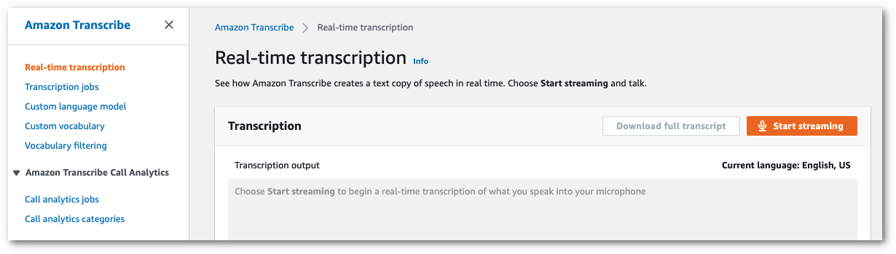
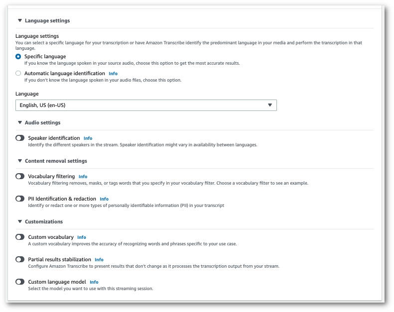
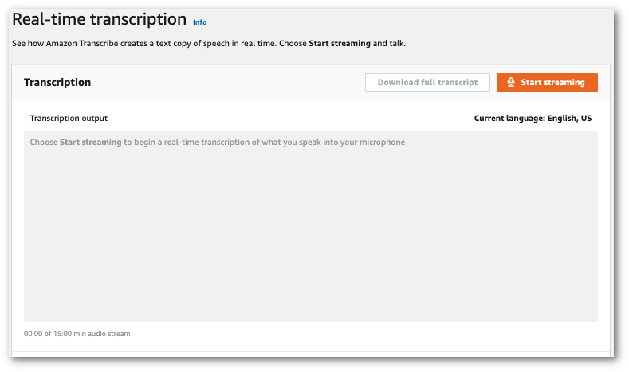
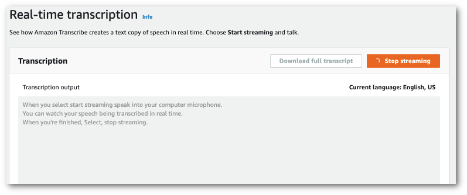

# Lab 2 - Stream processing

1.  From the [AWS Management Console](https://console.aws.amazon.com/transcribe), select **Real-time transcription** in the left navigation pane. This takes you to the main streaming page where you can select options prior to starting your stream.
    
    
    
2.  Below the **Transcription output** box, you have the option to select various language and audio settings.
    
    
    
3.  After you've selected the appropriate settings, scroll to the top of the page and choose **Start streaming**, then begin speaking into your computer microphone. You can see your speech transcribed in real time.
    
    
    
4.  When you're finished, select **Stop streaming**.
    
    
    
    You can now download your transcript by selecting **Download full transcript**.
    

1.  From the [AWS Management Console](https://console.aws.amazon.com/transcribe), select **Real-time transcription** in the left navigation pane. This takes you to the main streaming page where you can select options prior to starting your stream.
    
    
    
2.  Below the **Transcription output** box, you have the option to select various language and audio settings.
    
    
    
3.  After you've selected the appropriate settings, scroll to the top of the page and choose **Start streaming**, then begin speaking into your computer microphone. You can see your speech transcribed in real time.
    
    
    
4.  When you're finished, select **Stop streaming**.
    
    
    
    You can now download your transcript by selecting **Download full transcript**.
