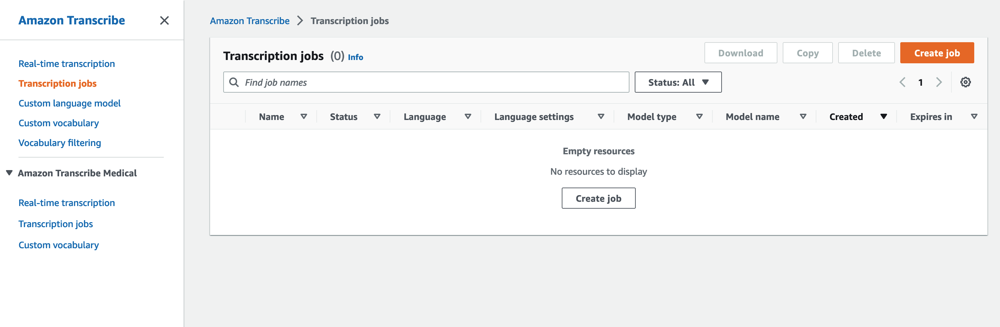
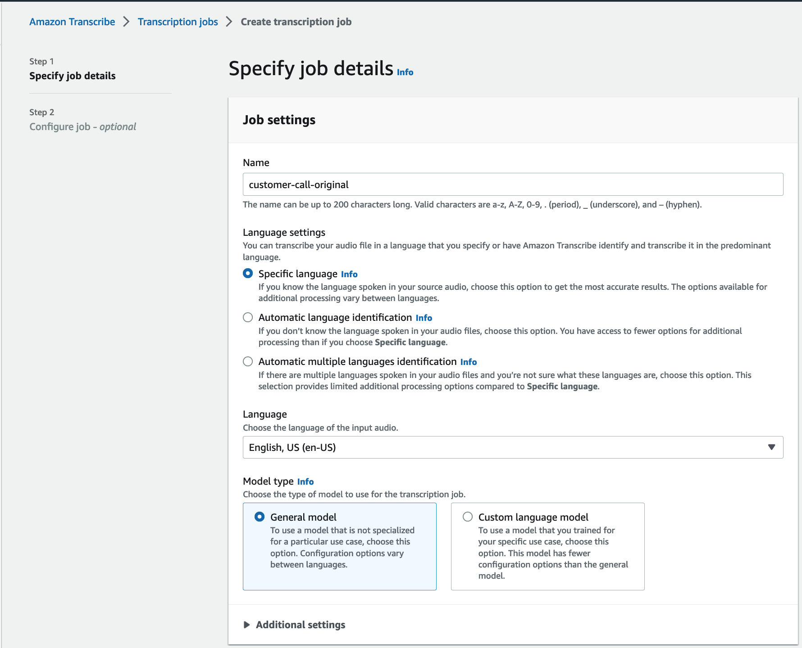
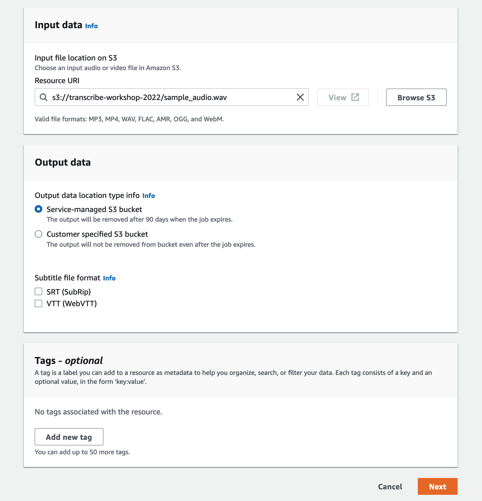
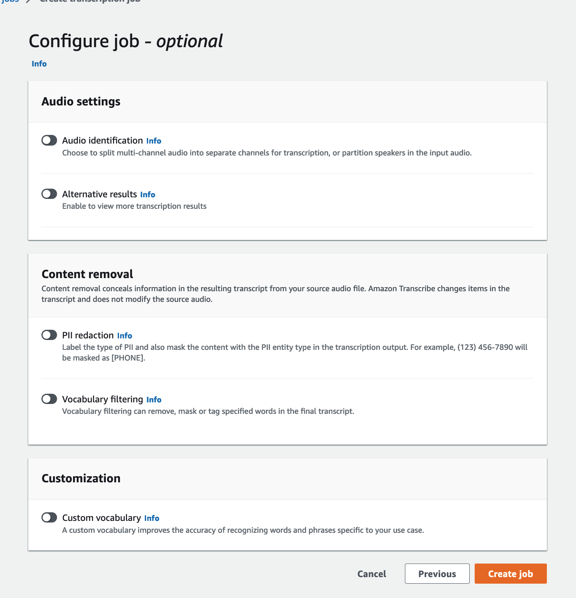
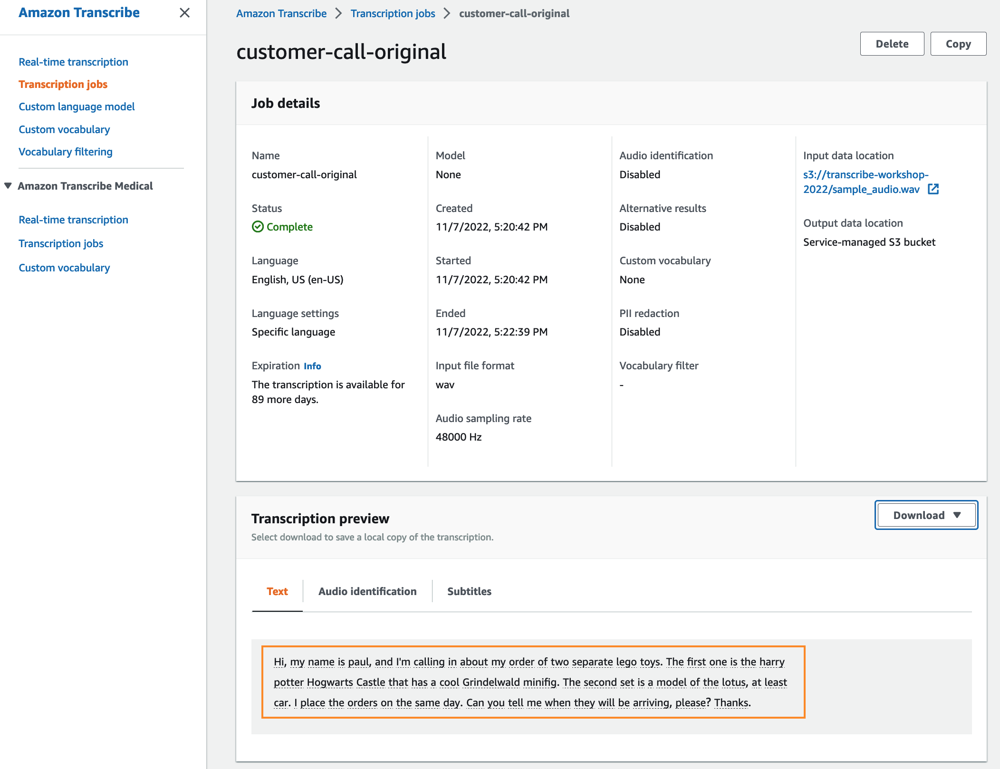

# Transcription prior to Custom Vocabulary

1.  Upload this [sample audio](https://aws-ml-blog.s3.amazonaws.com/artifacts/transcribe-customer-vocabulary/sample+audio.wav)to your S3 bucket (follow [documentation](https://docs.aws.amazon.com/AmazonS3/latest/gsg/GetStartedWithS3.html)). 

    For reference, here’s the audio file’s ground truth transcript:

    > “Hi, my name is Paul. And I’m calling in about my order of two separate LEGO toys. The first one is the Harry Potter Hogwarts Castle that has a cool Grindelwald mini-fig. The second set is a model of the Lotus Elise car. I placed the orders on the same day. Can you tell me when they will be arriving please?”

    As you can see, there are some very specific brand names and custom terms. Let’s see what happens when we pass the audio sample through Amazon Transcribe as is. 

2. Sign into the AWS Console, select Transcribe 

    

3. Create a new transcription job by clicking on 'Create job'. You will fill in the job name and leave the rest as defaults:

    

4. As you scroll down, in the 'Input data' section, point to the S3 bucket and audio file where you uploaded in first step. Leave the rest as defaults.

    

5.  Then, in the next screen, **Leave the custom vocabulary toggle to off, because we want to run a baseline transcription job without using the feature to see performance accuracy as is.** Leave all the remaining fields as default, since those are features we’re not interested in using for this baseline test. 

    

6.  Then, hit “Create Job” to initiate the transcription.

7.  Select "Transcription Jobs" and you will see that the transcription job has completed. Select the transcription job that matches the name you specified in step 3. You will see a preview window showing you the output text: 

    > "Hi, my name is paul, and I'm calling in about my order of two separate **lego** toys. The first one is the harry potter Hogwarts Castle that has a cool Grindelwald minifig. The second set is a model of the **lotus, at least** car. I place the orders on the same day. Can you tell me when they will be arriving, please? Thanks."

    

    Looks like the transcription output did pretty well overall, except it missed  “mini-fig” and “Lotus Elise”. Additionally, it didn’t capture “LEGO” properly with full capitalization. No surprise, as these are pretty content-specific custom terms.

So, let’s see how we can use the custom vocabulary feature’s custom pronunciation to enhance the transcription output in the next step.