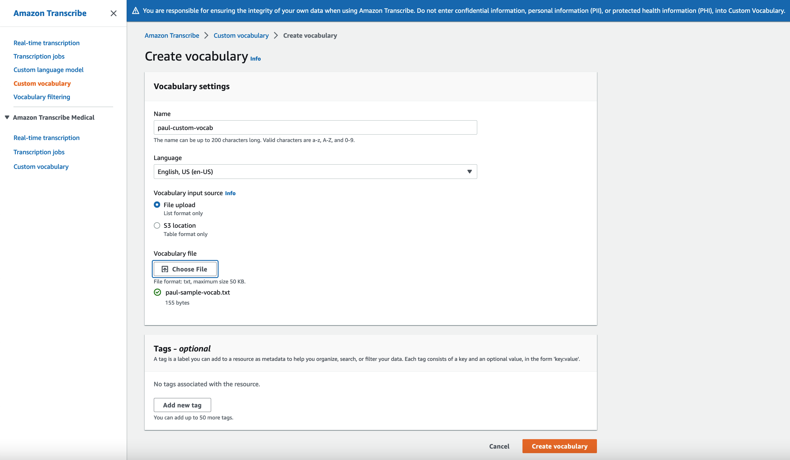

# Using Custom Vocab

1. First, we will prepare a vocabulary file, which not only lists the custom terms (Phrase), but also indicates the corresponding pronunciations.

    Refer to [create a new custom vocabulary file](https://docs.aws.amazon.com/transcribe/latest/dg/how-vocabulary.html)

    Using any text editor of your choice, create a .txt file that looks like below. In the text editor, configure the white bars to indicate when typing a tab for blanks where there are no inputs desired. Augment any of the words that were missed in the baseline transcription. Then, save the file as “paul-sample-vocab.txt”

    

2. Then, select 'Custom vocabulary' menu item on the left from the main Transcribe console. Select 'English, US (en-US)' for the language, select 'File Upload', chose your custom vocabulary text file and click “Create Vocabulary”:

    

3. You will be immediately taken to the 'Custom vocabulary' screen with 'pending' status

3. We can confirm that the custom vocabulary was successfully generated, as it will be visible in the custom vocabulary list:

