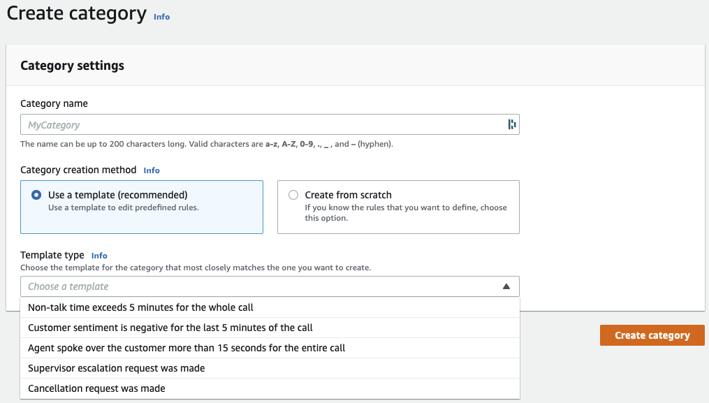
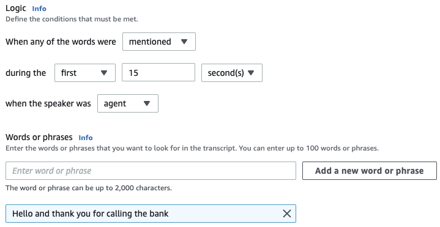

# 1 - Create categories
In this lab, you are going to familiarize with Transcribe Call Analytics along with call categories feature. First, we will create 'categories' based on rules. Then, create a call analytics job and show how categories is applied.

Here are a few examples of what you can do with custom categories:
- Isolate calls with specific characteristics, such as calls that end with a negative customer sentiment
- Identify trends in customer issues by flagging and tracking specific sets of keywords
- Monitor compliance, such as an agent speaking a specific phrase during the first few seconds of a call
- Gain insight into customer experience by flagging calls with many agent interruptions and negative customer sentiment
- Compare multiple categories to measure correlations, such as analyzing whether an agent using a welcome phrase correlates with positive customer sentiment 

### Steps:

1.  Use the [AWS CLI](https://aws.amazon.com/cli/) or AWS Console to upload the audio file to an S3 bucket. Make note of the S3 bucket path and region.

2.  Open Transcribe Call Analytics [console](https://console.aws.amazon.com/transcribe/#jobsAnalytics), I see that call category templates are available.

    

3.  Create Categories:
Here, we will create one for supervisor escalations. Then, we will create a custom call category named `welcome-message`, to check if the agent starts the call with an appropriate welcome. We could also add several phrases to check for if needed. We recommend that you use short sentences to minimize the chance of filler words popping up (‘hmm’, ‘err’, and so on).

In the next section, you will create the analytics job and analyze the results.