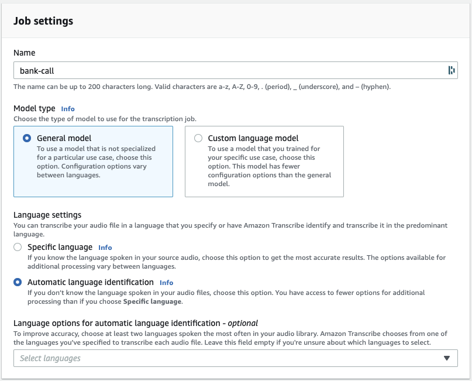
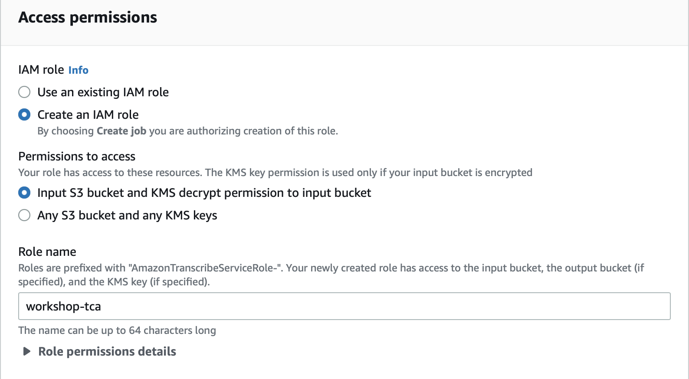
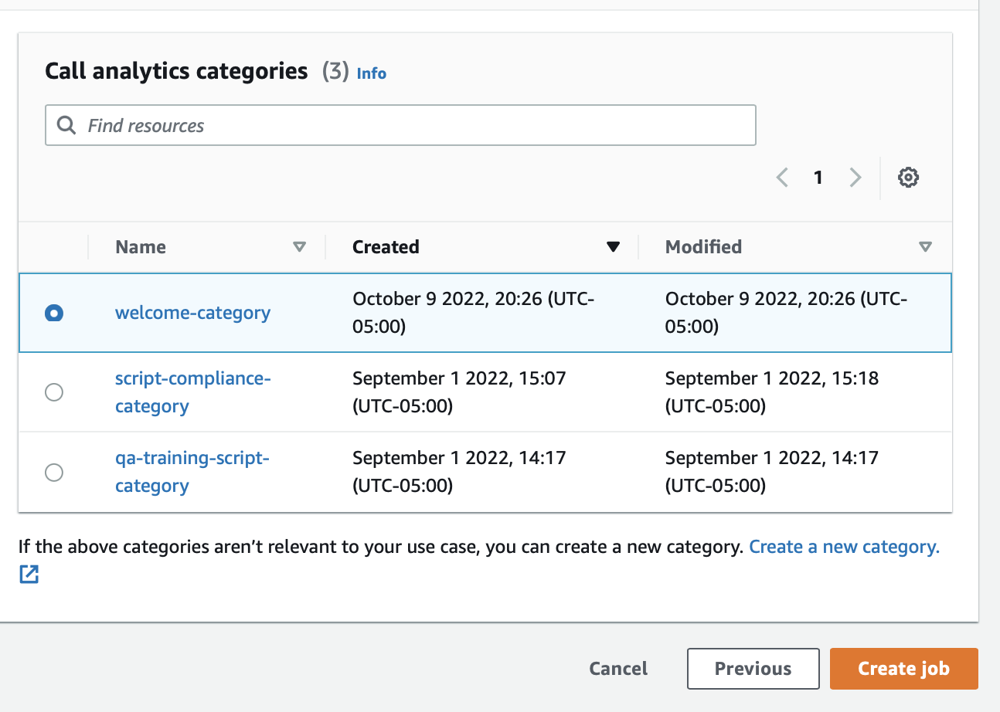
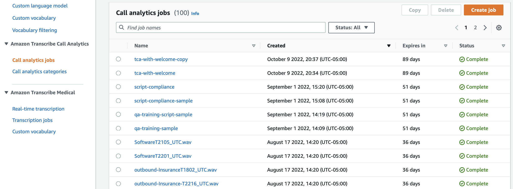
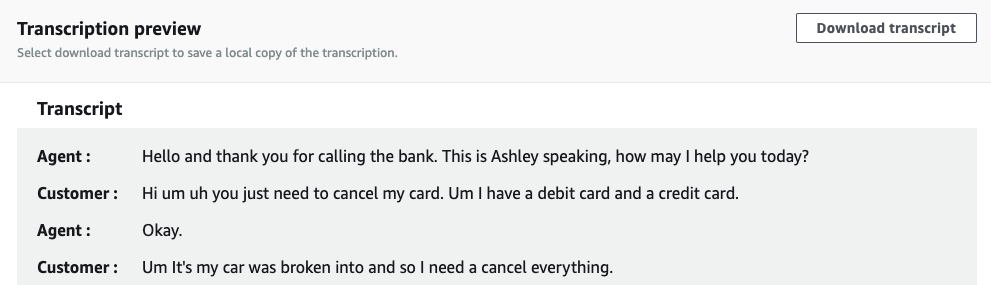
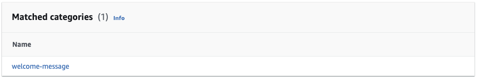

# 2 - Create call analytics and analyze

In the last section, you created categories. In this section, you are going to create call analytics and assign the category. You will also download the transcription from the job and analyze the results.

Before we create the call analytics job, here's a use case that can benefit from Transcribe Call Analytics with categories.

##### Use case - fictitious support call
A lady calls her bank to report that she’s lost her credit and debit cards. The sound file is a stereo WAV file (16-bit, 8KHz) which can be downloaded from :link[here]{href="../static/audio/demo-call.mp3" action="download"}.

:warning: {header="Important" type="info"}
Transcribe Call Analytics requires that the agent and the customer are recorded in their own channel. We’ll also need to tell which is the agent channel. In a stereo file, the left channel is usually the first channel (channel #0), and the right channel is the second one (channel #1).
:::

>If you’re not sure which is which, you can easily use the versatile [`ffmpeg`](https://ffmpeg.org/) open source tool to extract each channel to a separate audio file.

::code[$ ffmpeg -i demo-call.wav -map_channel 0.0.0 channel0.wav -map_channel 0.0.1 channel1.wav]

>You can use the same technique to extract audio channels from other file types, such as video files, and recombine them to a stereo audio file. You’ll find more information in the [`ffmpeg` documentation](https://trac.ffmpeg.org/wiki/AudioChannelManipulation).

### Steps:

1.  Navigate to Transcribe in AWS Console, select 'Call analytics jobs' under 'Amazon Transcribe Call Analytics' menu header on the left hand side.   

    

2.  Define the location of the audio file in S3, flagging channel #1 as the agent channel.

    

3.  Store the transcript in the default S3 bucket created by Transcribe. You could also use your own bucket if needed. Then, choose 'Create an IAM role' and specify a rolename prefix.
    
    

4.  Choose the Category that you created in the previous step:
    
    

5.  Click 'Create job' to start the job. 

6.  It will take a minute or so to finish the job. Click on 'Call analytics jobs' section on the left menu. 
    
    

7.  The console contains a preview of the text transcript, as well as a link to the full JSON transcript.

    

8. As the agent used the proper welcome sentence in the first 15 seconds, the call is tagged with the category I created earlier.

    

### Analyze the transcript:

Download the JSON transcript and analyze the transcript, each sentence in the conversation is enriched with metadata on **per-word loudness**, measured on a 0-100 range with 100 being extremely loud. 

Here’s the first sentence:

```json
"BeginOffsetMillis":440,"EndOffsetMillis":4960,  
"Sentiment":"NEUTRAL",  
"ParticipantRole":"AGENT",  
"LoudnessScores":[78.68,80.4,81.91,78.95,82.34],  
"Content":"Hello and thank you for calling the bank. This is Ashley speaking, how may I help you today?"
```

In the next sentence, Transcribe Call Analytics automatically detected what the **customer issue** is. The corresponding text is in bold:

```json
"Content": "Hi um uh you just need to **cancel my card**. Um I have a debit card and a credit card.",`  
`"IssuesDetected":``[``{``"UnredactedCharacterOffsets":``{``"Begin": 26,``"End": 40``}}. . .
```

At the end of the transcript, notice global **call statistics (duration, talk time, words per minute, matched categories)**. Transcribe also gives an **overall sentiment** information, measured from -5 (extremely negative) to +5 (extremely positive). You also get a a breakdown in four quarters.

```json
"Sentiment":{"OverallSentiment":{"AGENT":2.6,"CUSTOMER":0.2},  
"SentimentByPeriod":{"QUARTER":  
{"AGENT":[  
{"Score":1.9,"BeginOffsetMillis":0,"EndOffsetMillis":68457},  
{"Score":-0.7,"BeginOffsetMillis":68457,"EndOffsetMillis":136915},  
{"Score":5.0,"BeginOffsetMillis":136915,"EndOffsetMillis":205372},  
{"Score":3.0,"BeginOffsetMillis":205372,"EndOffsetMillis":273830}],  
"CUSTOMER":[  
{"Score":-1.7,"BeginOffsetMillis":0,"EndOffsetMillis":68165},  
{"Score":0.0,"BeginOffsetMillis":68165,"EndOffsetMillis":136330},  
{"Score":0.0,"BeginOffsetMillis":136330,"EndOffsetMillis":204495},  
{"Score":2.1,"BeginOffsetMillis":204495,"EndOffsetMillis":272660}]}}}
```

Notice that the customer started the call with negative sentiment, moving quickly to neutral sentiment, and ending the call with positive sentiment. This is a good sign that the call was handled satisfactorily, and that the customer problem was solved.

Congrats, you have completed Transcribe Call Analytics lab!

